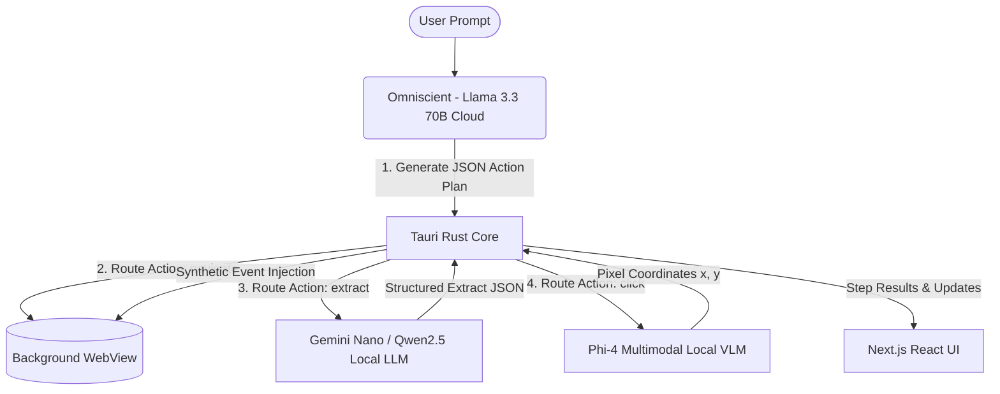

# Step 1: Project Architecture Analysis & Research Roadmap

**Date:** May 25, 2026  
**Phase:** Phase 1 (Foundation & Browser Shell)  
**Author:** Faisal Sorkar  

---

## 1. Introduction & Context

This document initiates the development logs for **N.O.V.A. (No-DOM Orchestrated Visual Agent)**, a final year computer science thesis project. N.O.V.A. is a desktop browser engineered to perform autonomous web automation using a local-first, vision-based approach. 

Traditional automation engines (e.g., Playwright, Selenium, Puppeteer) depend on HTML DOM selectors. While highly precise when a website remains static, these selectors are fragile and break upon any DOM modification (such as class renaming, layout shifts, or framework migrations). N.O.V.A. bypasses this limitation by adopting a **No-DOM visual automation** design: it captures screenshots of the web page and reasons about coordinates visually using a localized multimodal vision model, interacting with elements via synthetic OS-level mouse and keyboard events.

---

## 2. Tri-Model Architecture Specification

N.O.V.A. relies on a coordinated, asynchronous loop between three specialized models, optimizing for computational efficiency, latency, cost, and privacy.

### 2.1 The Omniscient (Cloud Orchestrator)
- **Role:** High-level planner and task decomposer.
- **Model:** Llama 3.3 70B via Groq API (or Gemini 1.5 Pro).
- **Execution Location:** Cloud (Stateless API).
- **Rationale:** Translating unstructured user requests (e.g., *"Find the cheapest laptop on Amazon"*) into structured execution plans requires advanced reasoning capabilities. Doing this locally requires heavy models (30B+ parameters) which are slow and memory-intensive on typical consumer hardware. By using Llama 3.3 via Groq, we maintain a latency of ~500ms for planning while sending only the user's intent to the cloud, ensuring browsing history and page contents remain strictly local.
- **Output Schema:** JSON execution graph array of actions.

### 2.2 Gemini Nano (Local Extractor)
- **Role:** Local text extraction and structured parsing.
- **Model:** Gemini Nano via Chrome `window.ai` (with local Qwen2.5-1.5B fallback).
- **Execution Location:** Local (hidden WebView or local HTTP sidecar).
- **Rationale:** Web scraping often retrieves massive raw text dumps. Parsing this text into clean JSON (such as `{ "price": "$999", "in_stock": true }`) must be done locally to prevent sensitive data (like bank details or private accounts) from leaking. Gemini Nano runs on the client device, rendering extraction cost-free and private.

### 2.3 Phi-4 Multimodal (Visual Grounding Navigator)
- **Role:** Visual UI grounding and coordinate estimation.
- **Model:** Phi-4 Multimodal (5.6B GGUF).
- **Execution Location:** Local (Python FastAPI sidecar via `llama-cpp-python` with GPU acceleration).
- **Rationale:** To click a button without DOM selectors, N.O.V.A. captures a screenshot, runs local vision inference, and receives `{x, y}` coordinates of the requested button (e.g., *"the Google Search button"*). Phi-4 Multimodal provides high visual grounding accuracy while running locally in consumer-grade GPU VRAM (~4GB).

---

## 3. Technology Stack Choice & System Boundaries

| Layer | Selection | Engineering Rationale |
|---|---|---|
| **App Shell** | Tauri 2.0 (Rust) | Provides native performance, multi-webview routing, secure system IPC, and direct control over window creation, screenshot capture, and OS event injection. Far lower resource overhead compared to Electron. |
| **Frontend** | Next.js 14/15/16 + React | Standard UI layer allowing fast layout cycles, clean state management, and direct integration with Tauri's client library. |
| **Styling** | Tailwind CSS + shadcn/ui | Accelerated prototyping of premium, responsive components with dark mode support. |
| **Local Sidecar** | Python FastAPI | Wraps the llama-cpp-python vision engine. Tauri manages this as a binary process, starting and stopping it with the main application lifecycle. |

---

## 4. Phase 1 Technical Design: The Browser Shell

For Phase 1, we establish the core browser controls. Before introducing AI, we need a shell that can load pages in a separate window and interact with it.

### Key Deliverables:
1. **Dual-Pane Layout:**
   - **Right Panel:** A glassmorphic sidebar featuring the Chat Interface (user text input and mock message log).
   - **Left Panel:** A browser simulation viewport, displaying page title, address bar, navigation buttons (Back, Forward, Refresh, Go), and developer controls.
2. **Tauri IPC Command Pipeline:**
   - `navigate_to(url)`: Instructs Tauri to command the background window to navigate.
   - `get_page_title()`: Inject a Javascript snippet (`document.title`) into the background window and return it to the React UI.
   - `toggle_browser_visibility()`: Show or hide the background window to allow developers to verify the background state matches the simulated address bar.

---

## 5. Summary of Phase 1 Setup Action

### What was done:
- Analyzed project requirements and finalized the 6-phase development roadmap.
- Formulated system design diagrams and documented architectural trade-offs.
- Created `project_steps/01_project_analysis.md`.

### Why it was done:
- Establishes academic and technical rigour at the beginning of the project.
- Ensures a clear roadmap exists, tracking how each component communicates.
- Prepares documentation logs required for the final thesis.

### How it was done:
- Conducted codebase inspections of the initialized Next.js + Tauri workspace.
- Reviewed standard Tauri 2.0 configuration, Next.js routing, and styling layouts.
- Structured the Phase 1 goals around establishing Tauri Rust-to-JS communication.
